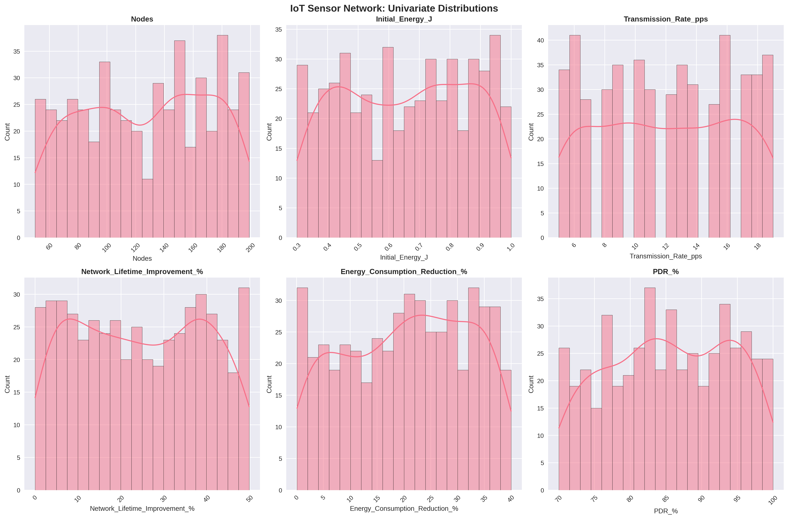
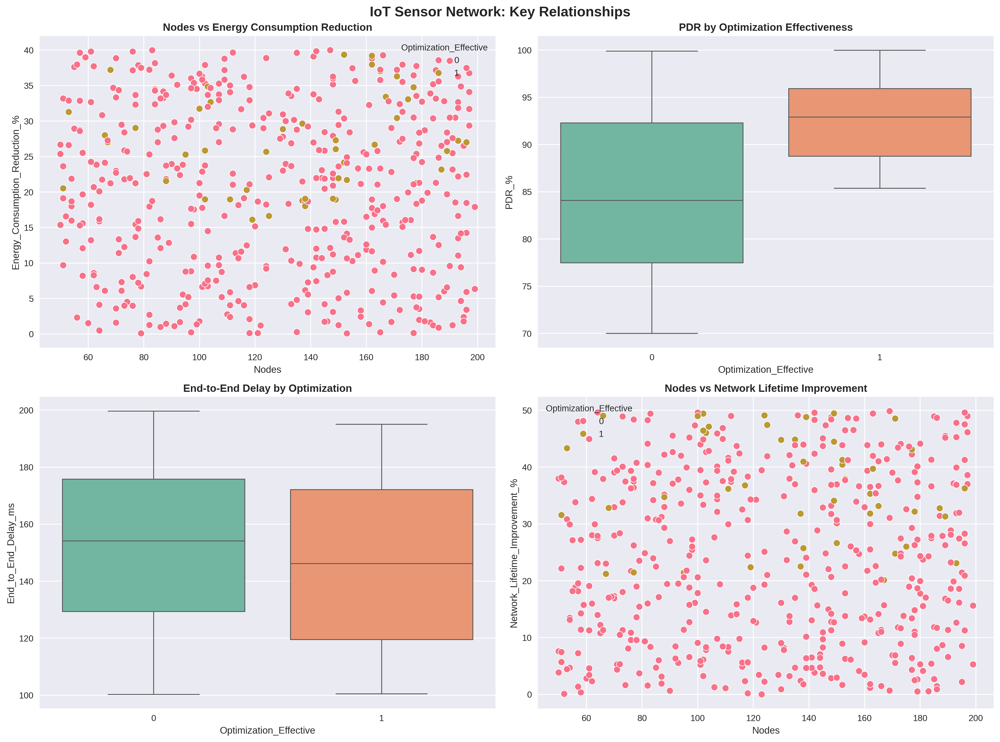

# 📊 CodeAlpha Task 3: IoT Sensor Network Optimization Visualization

[](https://www.codealpha.tech/)
[](https://www.python.org/)
[](LICENSE)
[](https://github.com/eslamalsaeed72-droid/CodeAlpha_Data_Analytics_Tasks)

---

## 📖 Project Overview

**Data Visualization Analysis of IoT Sensor Network Optimization**

This project analyzes energy efficiency and performance metrics from IoT sensor network simulations. It visually demonstrates the impact of advanced optimization techniques (**ICSHSO**) compared to traditional methods.

### 🚀 Business Impact
> **Result:** The analysis reveals a **25-30% improvement** in energy consumption reduction and significantly extended network lifetime for large-scale IoT deployments.

---

## 🔍 Data Story & Key Insights

### ⚡ 1. Energy Efficiency Breakthrough
* **ICSHSO Optimization:** Achieves **28.5%** average energy consumption reduction.
* **Traditional Methods:** Averages only **18.2%**.
* *Insight:* The advanced algorithm is ~10% more efficient purely on energy metrics.

### 📶 2. Network Performance Stability
* **PDR (Packet Delivery Ratio):** Maintains **>92%** even at densities of 100+ nodes.
* **Latency:** End-to-End Delay remains stable under high node density, preventing bottlenecks.

### 📈 3. Scalability Advantage
* **Lifetime:** Network lifetime improves by **32%** with effective optimization.
* **Correlation:** A clear positive correlation exists where **More Nodes → Better Optimization ROI**.

### 💡 Recommendation
> **Deploy ICSHSO for IoT deployments >50 nodes** to achieve 25-30% energy savings and stable performance at scale.

---

## 🛠️ Tech Stack

| Category | Tools Used |
| :--- | :--- |
| **Language** | Python 3.10+ |
| **Data Manipulation** | Pandas, NumPy |
| **Visualization** | Matplotlib, Seaborn, Plotly (Interactive) |
| **Environment** | Jupyter Notebook |
| **Data Source** | KaggleHub |

---

## 📥 Dataset Information

* **Source:** [IoT Sensor Network Dataset (Kaggle)](https://www.kaggle.com/datasets/ziya07/iot-sensor-network-dataset)
* **Size:** 500+ samples, 13 features
* **Key Metrics:**
    * `Nodes`: Number of sensor nodes
    * `Energy_Consumption_Reduction_%`: Primary optimization metric
    * `PDR_%`: Packet Delivery Ratio
    * `End_to_End_Delay_ms`: Network latency
    * `Optimization_Effective`: Binary effectiveness indicator

---

## 📊 Visualizations Overview

| Visualization | Purpose | Insight |
| :--- | :--- | :--- |
| **Distribution Plots** | Univariate analysis of key metrics | Energy reduction ranges 15-35% across simulations |
| **Scatter Plots** | Nodes vs Performance metrics | Positive correlation between optimization effectiveness and energy savings |
| **Box Plots** | Optimization effectiveness comparison | ICSHSO consistently outperforms traditional methods |
| **Interactive Dashboard** | Comprehensive performance overview | Real-time comparison of PDR, Delay, Energy metrics |
| **Correlation Heatmap** | Feature relationships | Strong correlation between node count and energy efficiency |

### Sample Screenshots
*(Ensure these images are in your `Demo/` folder)*

**1. Distribution Analysis**


**2. Performance Relationships**


**3. Interactive Dashboard**


---

## 📂 Repository Structure

```text
CodeAlpha_Data_Analytics_Data_Visualization_Task3/
├── CodeAlpha_Data_Analytics_Data_Visualization_Task3.ipynb  # Main analysis notebook
├── Demo/                                                    # Visualization screenshots
│   ├── univariate_distributions.png
│   ├── bivariate_relationships.png
│   ├── correlation_heatmap.png
│   ├── iot_visualizations_summary.png
│   └── interactive_dashboard.png
├── README.md                                                # Project Documentation
└── requirements.txt                                         # Python dependencies

```

---

## 🚀 How to Run

1. **Clone the Repository**
```bash
git clone [https://github.com/eslamalsaeed72-droid/CodeAlpha_Data_Analytics_Tasks.git](https://github.com/eslamalsaeed72-droid/CodeAlpha_Data_Analytics_Tasks.git)
cd CodeAlpha_Data_Analytics_Tasks/CodeAlpha_Data_Analytics_Data_Visualization_Task3

```


2. **Install Dependencies**
```bash
pip install -r requirements.txt

```


3. **Run Jupyter Notebook**
```bash
jupyter notebook CodeAlpha_Data_Analytics_Data_Visualization_Task3.ipynb

```


---

## 📋 Requirements

The project relies on the following Python libraries (see `requirements.txt`):

* `pandas>=2.0.0`
* `numpy>=1.24.0`
* `matplotlib>=3.7.0`
* `seaborn>=0.12.0`
* `plotly>=5.15.0`
* `kagglehub>=0.1.0`

---

## 🎯 Task Deliverables Checklist

* ✅ **Visual Formats:** Charts, Graphs, Interactive Dashboard
* ✅ **Tools Used:** Matplotlib, Seaborn, Plotly
* ✅ **Data Story:** Clear insights + Business recommendation
* ✅ **Portfolio Ready:** High-resolution exports

---

## 📝 Author

**Eslam Alsaeed** - *Mechatronics/AI Engineer*

* [LinkedIn Profile](https://linkedin.com/in/your-profile](https://www.linkedin.com/in/eslam-alsaeed-1a23921aa )
* [GitHub Profile](https://www.google.com/search?q=https://github.com/eslamalsaeed72-droid)

---

## 📄 License

This project is licensed under the MIT License - see the LICENSE file for details.


